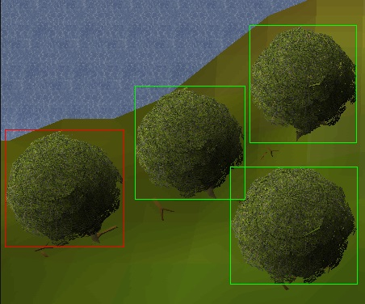
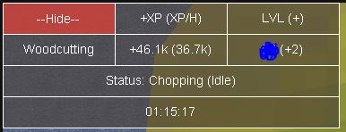

# Mark N' Chop

A OSBot powerchopping script.
 
Start with axe equipped or in inventory.

### Features:
* Random inventory shift click drop orders.
    * If player stops chopping, may drop logs if inventory is almost full to prepare for next AFK cycle. 
    * Can't AFK much if not many inventory freespace
* AFK simulation, different AFK timings every script run session
  * gaussian / random normal distribution / bell curve timings
  * tiggered if inventory is full or if the tree was chopped down.
* Dragon axe special (If equipped)
* Picks up nests

### Requirements:

* axe equipped or in inventory
* best used in a SAFE area where trees are close by

### Paint:
* Tree Selection (Click to select, Click again to deselect.)
  * 

* XP/Status/Time
  * 

